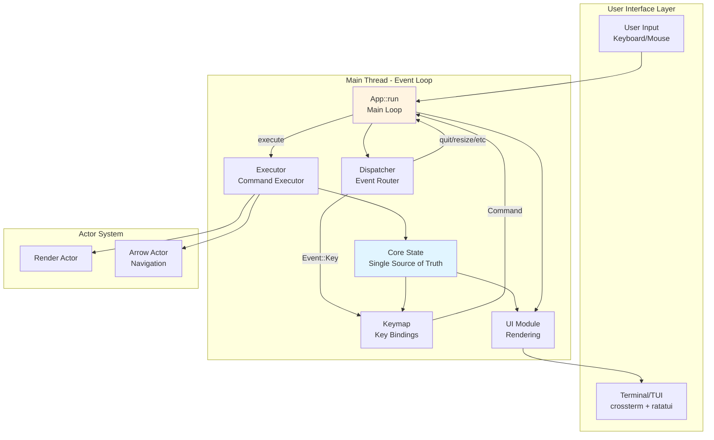
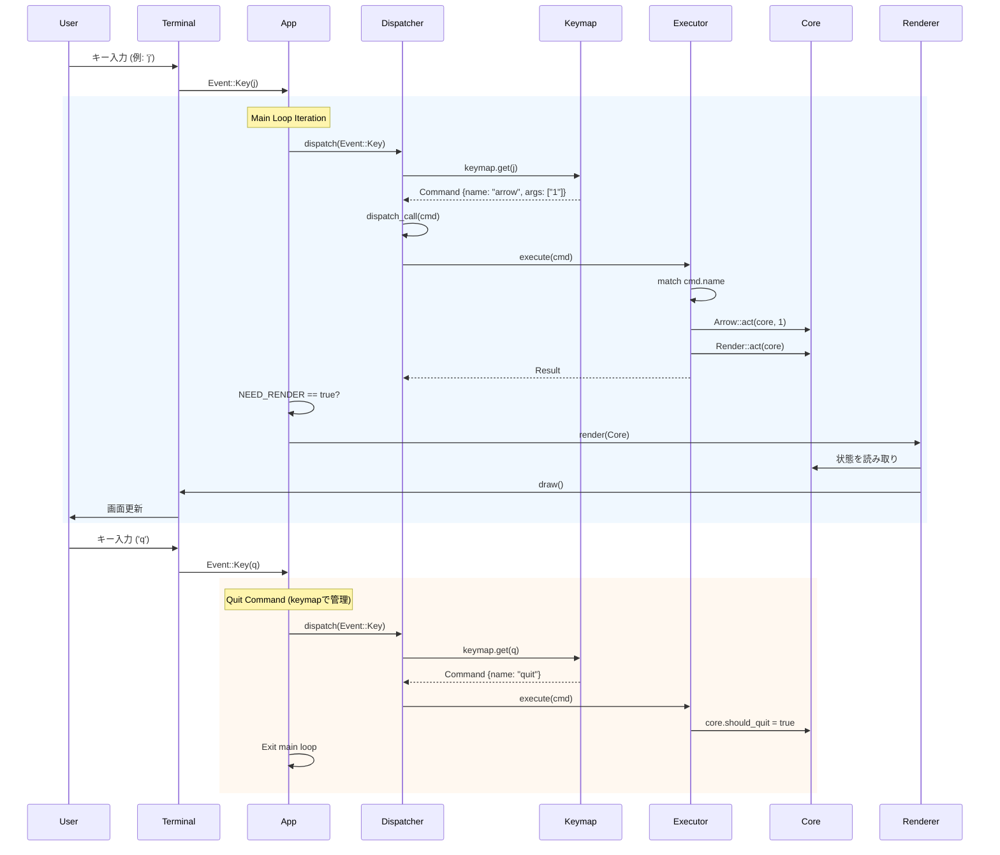

# pueue-tui アーキテクチャドキュメント

このドキュメントは、yaziのアーキテクチャパターンを採用したpueue-tuiの構造を説明します。

## 設計原則

1. **イベント駆動アーキテクチャ**: すべての処理はイベントとして扱う
2. **コマンドパターン**: キー入力とロジックを分離
3. **Actor Model**: 各機能を独立したActorとして実装
4. **シンプルさ**: yaziの優れたパターンを採用しつつ、過度な抽象化を避ける

## yaziとの類似点と相違点

### 類似点
- **Dispatcher** → `&'a mut App`を持ち、`self.app.xxx()`で呼び出す
- **Event::Call(Command)**: コマンドをイベントとして発行
- **Keymap**: KeyEvent → Command の変換テーブル
- **Command**: Cow使用の構造体（CmdCow相当）
- **Executor**: Commandを実際の処理にルーティング

### 相違点
- **Ctxなし**: シンプルにCoreを直接渡す
- **Layerなし**: 単一画面なのでレイヤー分けは不要
- **act!マクロなし**: 直接Actor::act()を呼ぶ
- **すべてkeymap管理**: quit等も含めてkeymapで管理（自己責任）

## アーキテクチャ図



## イベントフロー



## コンポーネント詳細

### 1. Event System (`event.rs`)

イベントの定義と配信を管理します。

```rust
pub enum Event {
   Call(Command),       // コマンド実行
   Key(KeyEvent),       // キーボード入力
   Mouse(MouseEvent),   // マウス操作
   Resize,              // ターミナルサイズ変更
   Focus,               // フォーカス変更
   Paste(String),       // ペースト
   Quit,                // 終了シグナル
   Error(Report),       // エラー
}
```

**設計のポイント**:
- Event::Call(Command)でコマンドをイベントとして発行可能
- グローバルな`UnboundedChannel`でイベントを配信
- `NEED_RENDER`フラグで再描画を効率的に制御

### 2. Dispatcher (`dispatcher.rs`)

yaziと同じパターン：`&'a mut App`を持ち、`self.app.xxx()`で呼び出します。

**役割**:
- システムイベント → Appの直接メソッド呼び出し（quit, resize, focus, paste）
- Event::Call → Executorに委譲
- Event::Key → Keymap経由でCommand化してExecutorに委譲

```rust
pub struct Dispatcher<'a> {
   app: &'a mut App,
}

// yaziと同じパターン
Event::Resize => self.app.resize(),
Event::Quit => self.app.quit(),
```

### 3. Keymap (`router.rs`)

キー入力とCommandのマッピングを管理します。

**役割**:
- KeyEvent → Command の変換テーブル
- Coreに保持され、将来的に設定ファイルから読み込み可能
- HashMap<(KeyCode, KeyModifiers), Command>で実装
- **quitもkeymapで管理**（特別扱いしない、自己責任）

```rust
// quitもkeymapに含まれる
bindings.insert(
   (KeyCode::Char('q'), KeyModifiers::NONE),
   Command::new("quit"),
);
```

### 4. Command System (`command.rs`)

yaziのCmdCowと同じCow使用の構造体です。

```rust
pub struct Command {
   pub name: Cow<'static, str>,
   pub args: Vec<Cow<'static, str>>,
}
```

**設計のポイント**:
- `Cow`を使用してゼロコストな文字列管理
- 静的な文字列はコンパイル時に埋め込み
- 動的な引数も柔軟に扱える
- yaziのCmdCowと同じ設計

### 5. Executor (`executor.rs`)

Commandを実行し、適切なActorを呼び出します。

**役割**:
- Command名でルーティング
- Actorの呼び出しと引数の変換
- `Ctx`（実行コンテキスト）の管理

```rust
pub fn execute(&mut self, command: Command) -> Result<()> {
    let mut cx = Ctx::new(self.core);
    
    match command.name.as_ref() {
        "quit" => Quit::act(&mut cx, ()),
        "arrow" => {
            let step = command.first_arg()
                .and_then(|s| s.parse::<i32>().ok())
                .unwrap_or(0);
            Arrow::act(&mut cx, step)
        }
        _ => Ok(())
    }
}
```

### 6. Actor System (`actors/`)

各機能を独立したActorとして実装します。

**Actor trait**:
```rust
pub trait Actor {
    type Options;
    fn act(cx: &mut Ctx, options: Self::Options) -> Result<()>;
}
```

**Ctx（実行コンテキスト）**:
```rust
pub struct Ctx<'a> {
    pub core: &'a mut Core,      // アプリケーション状態
    pub level: usize,             // ネストレベル
    #[cfg(debug_assertions)]
    pub backtrace: Vec<&'static str>,  // デバッグ用バックトレース
}
```

**現在実装されているActor**:
- `Quit`: アプリケーション終了
- `Render`: 再描画要求
- `Arrow`: カーソル移動（未完成）

**Actorのメリット**:
1. **テスト可能性**: 各Actorを独立してテスト可能
2. **再利用性**: 他のActorから呼び出し可能
3. **デバッグ性**: バックトレースで呼び出し経路を追跡
4. **拡張性**: 新しいActorを追加するだけで機能拡張

### 7. Core State (`core.rs`)

アプリケーション全体の状態を保持します（Single Source of Truth）。

現在はミニマルな実装ですが、今後以下を追加予定:
- タスクリスト
- 選択状態
- フィルター設定
- UI状態（アクティブなパネルなど）

### 8. UI Rendering (`ui.rs`)

Coreの状態を読み取ってUIを描画します。

**設計のポイント**:
- Coreを変更しない（読み取り専用）
- 描画ロジックと状態管理を分離
- ratatuiを使用した宣言的UI

## yaziとの主な違い

### 簡略化した部分

1. **プラグインシステム**: 現時点では未実装
2. **タスクスケジューラ**: 非同期処理が必要になったら追加予定
3. **複数レイヤー**: 現在は単一画面のみ
4. **設定システム**: ハードコードされたキーマップのみ

### 今後の拡張計画

1. **IO Actor**: daemon通信を独立したActorに分離
2. **タスクスケジューラ**: 重い処理をバックグラウンドで実行
3. **設定ファイル**: TOMLでキーマップやテーマを設定可能に
4. **複数のView**: タスクリスト、ログビュー、詳細ビューなど

## ディレクトリ構造

```
src/
├── main.rs          # エントリーポイント
├── app.rs           # メインループとイベント処理
├── event.rs         # イベント定義と配信
├── dispatcher.rs    # イベントルーティング
├── router.rs        # キーマッピング
├── command.rs       # コマンド定義
├── executor.rs      # コマンド実行
├── core.rs          # アプリケーション状態
├── actors.rs        # Actor trait定義
├── actors/
│   ├── quit.rs
│   ├── render.rs
│   └── arrow.rs
├── ui.rs            # UI描画
├── terminal.rs      # ターミナル制御
└── cli.rs           # CLI引数パース
```

## まとめ

このアーキテクチャは、yaziの優れた設計を参考にしながら、pueue-tuiの要件に合わせて簡略化したものです。

**主な利点**:
- **保守性**: 関心の分離により、各コンポーネントが独立
- **拡張性**: 新しいActorやCommandを追加するだけで機能追加可能
- **テスト可能性**: 各レイヤーを独立してテスト可能
- **パフォーマンス**: イベント駆動とスロットリングで効率的な再描画
- **柔軟性**: キーマッピングを簡単にカスタマイズ可能

今後、実際の機能を追加していく中で、yaziのSchedulerやPlugin systemなどの要素を必要に応じて取り入れていく予定です。
