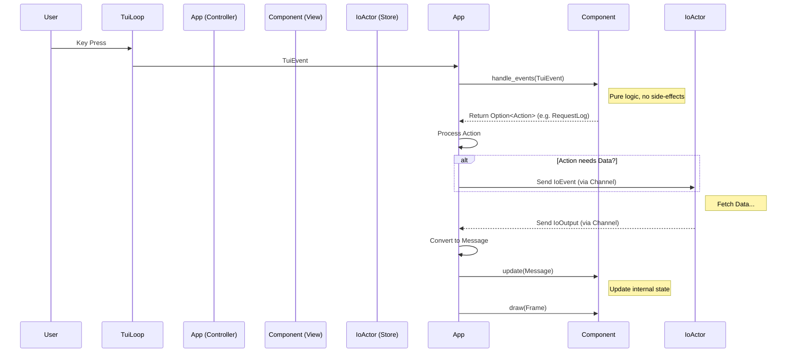

# Architecture Review & Refactoring Roadmap

This document serves as a central registry for architectural decisions, planned refactorings, and design notes.

## 1. Communication Layer Refactoring

**Goal**: Decouple data fetching logic from the UI controller (`App`) to improve scalability, performance, and maintainability.

### Current Issues (As-Is)
- **Coupling**: The `App` struct directly manages the `Client` and initiates `tokio::spawn` calls for data fetching. This acts as a "God Object" anti-pattern, mixing UI control logic with network implementation details.
- **Race Conditions & Waste**: Rapid user input (e.g., holding the generic "Down" key to scroll) triggers a new asynchronous request for every single step. This "fire-and-forget" approach wastes network resources and risks displaying stale data if responses arrive out of order.
- **State Dispersion**: Data ownership is unclear. `App` manages the client connection, while `Home` holds the fetched data. This fragmentation makes it difficult to share state (e.g., the global task list) with potential future components (like a "Detail View" or "Dashboard").

### Proposed Architecture: IO Actor Pattern
Transition to an **IO Actor (Data Store)** pattern. This involves creating a dedicated, long-running background task responsible for all daemon communication.

#### Structure
- **Main Thread (UI / App)**:
  - **Responsibility**: Purely handles user input and rendering.
  - **Interaction**: Sends explicit `IoEvent` requests (e.g., `IoEvent::GetLog(id)`) via a channel. Listens for `IoOutput` updates to refresh the UI.
  - **Logic**: No longer knows about `pueue-lib` or connection details.

- **IO Thread (Data Actor)**:
  - **Responsibility**: Manages the `Client` connection and executes data fetching strategies.
  - **Capabilities**:
    - **Debouncing**: Implements logic to wait (e.g., 100ms) before fetching heavy data (logs) during rapid scrolling, cancelling pending requests if a new one arrives.
    - **Error Handling**: Centralizes network error handling before passing sanitized results to the UI.

### Implementation Steps
1.  **Define Protocol**: Create `IoEvent` (Input) and `IoOutput` (Output) enums to strictly type the communication between threads.
2.  **Create IO Loop**: Implement the `IoActor` struct and its run loop. This component will own the `Client` and handle the debouncing logic (likely using `CancellationToken`).
3.  **Refactor App**:
    - Remove `Client` ownership from `src/app.rs`.
    - Replace ad-hoc `tokio::spawn` blocks with `io_tx.send(IoEvent::...)`.
    - Update `handle_actions` to process incoming `IoOutput` messages.

## 2. Event & Action Flow Clarity

**Goal**: Disambiguate inputs (`Event`) from logic (`Action`) and enforce a strictly Unidirectional Data Flow (UDF) using return values instead of side-channels.

### Decision: React/Redux-like Flow
We will adopt a layered architecture inspired by The Elm Architecture (TEA) and Redux, adapted for Rust's ownership model.

#### The 3-Layer Concept
1.  **TuiEvent (Input)**: Raw stimuli (Key press, Resize).
2.  **Action (Intent)**: Logical commands returned by Components *after* processing input (e.g., `SelectTask`, `Quit`).
3.  **Message (Data)**: Data updates flowing *down* from App/IO to Components (e.g., `LogLoaded`).

#### Data Flow Diagram

### Refactoring Roadmap
1.  **Rename**: `tui::Event` -> `tui::TuiEvent` to avoid confusion.
2.  **Purify Components**: 
    - Remove `UnboundedSender<Action>` from `Component` structs.
    - Ensure `handle_events` returns `Option<Action>` for all user intents.
3.  **Split Enums**: Clearly separate "UI Actions" (Upward) from "Data Messages" (Downward) in the type system.